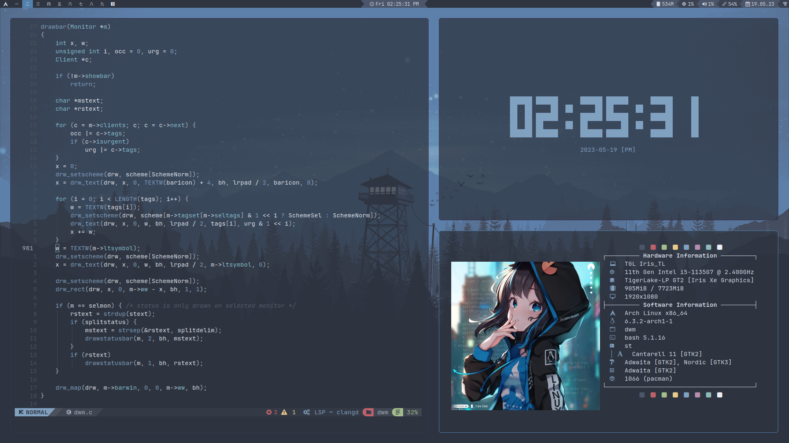
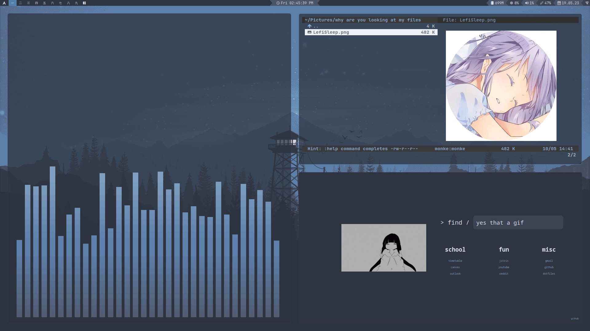

# Suckless Monke Rice
Suckless software so easy even a monkey could do it

# Screenshots




# Installation (for me not you)
```
rm .bashrc
echo ".dotfiles" >> .gitignore
git clone --bare https://github.com/MonkieeBoi/.dotfiles.git $HOME/.dotfiles
git --git-dir=$HOME/.dotfiles --work-tree=$HOME checkout
source .bashrc
config config --local status.showUntrackedFiles no
```

# What I Use
**Operating System** - [Arch Linux]()

**Color Scheme** - [Nord]()

**Window Manager** - [dwm]()

**Terminal** - [st]()

**Text Editor** - [NeoVim]()

**Menus** - [dmenu]()

**File Manager** - [vifm]()

**Browser** - [qutebrowser]()

**Image Viewer & Wallpapers** - [feh]()

**Compositor** - [picom]()

**Screenshots** - [shotgun]()

**Audio Visualiser** - [CAVA]()

**Keybinds** - [sxhkd]()

**Notifications** - [dunst]()

**Font** - [JetBrains Mono Nerd Font]()
